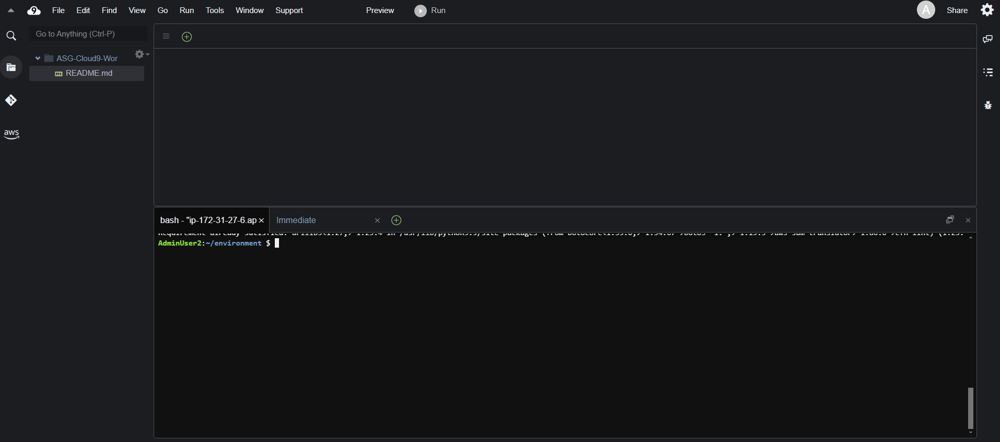
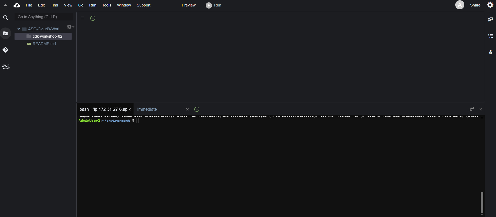
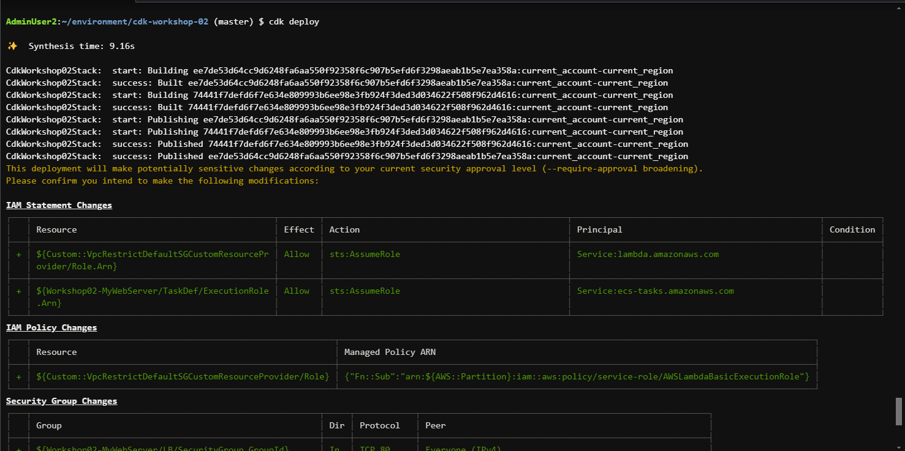

 
#### Tạo cụm ECS và Application Load Balancer

1. Truy cập vào workspace Cloud9 đã tạo


2. Tạo một thư mục mới có tên **```cdk-workshop-02```**


3. Khởi tạo project CDK
```bash
cd ~/environment/cdk-workshop-02
cdk init --language python
```

4. Import các thư viện cần thiết trong file `cdk-workshop-02/cdk_workshop_02_stack.py`

```python
from aws_cdk import (
    Stack,
    aws_ecs as ecs,
    aws_ecs_patterns as ecsp,
    aws_apigateway as apigateway
)
from constructs import Construct
```

5. Trong file `cdk-workshop-02/cdk_workshop_02_stack.py`, khai báo một dịch vụ ECS kết hợp với Application Load Balancer trong hàm `__init__()`
```python
      # Declare a Load Balancer Fargate 
      lb_fargate_service = ecsp.ApplicationLoadBalancedFargateService(
				self, 
				"Workshop02-MyWebServer",
            task_image_options=ecsp.ApplicationLoadBalancedTaskImageOptions(
               image=ecs.ContainerImage.from_registry("nginxdemos/hello")
            ),
            public_load_balancer=True,
            desired_count=3
      )
```

`ecsp.ApplicationLoadBalancedFargateService` sẽ khởi tạo các resource sau:

- Một VPC mới với các cấu hình (subnet, Internet Gateway, RouteTable, EIP, Nat Gateway, …) được khởi tạo theo tuỳ chọn mặc định.
- Một ECS cluster nằm trong VPC mới được tạo, với chế độ chạy sử dụng Fargate
- Một ECS Task được định nghĩa bằng image `nginxdemos/hello` từ Dockerhub
- Một nhóm ECS container được chạy từ ECS Task vừa tạo, với số instance là 3
- Một Application Load Balancer nằm trước cụm ECS vừa tạo
- Các Role và Security Group cần thiết

#### Cấu hình API Gateway

6. Khai báo API Gateway
```python
# Define API Gateway
api = apigateway.RestApi(self, "ProxyToLBECS")
```

7. Cấu hình API Gateway resource để trỏ đến DNS của Application Load Balancer
```python
# Get the DNS value of the Application Load Balancer 
lb = lb_fargate_service.load_balancer
lb_dns = lb_fargate_service.load_balancer.load_balancer_dns_name

# Add resource and method for proxy request
proxy = api.root.add_resource("ecs")
proxy.add_method("GET", apigateway.HttpIntegration(f"http://{lb_dns}"))
```

Bạn có thể đọc thêm về các phương thức và thuộc tính của ApplicationLoadBalancedFargateService tại [tài liệu chính thức về CDK của AWS (Python)](https://docs.aws.amazon.com/cdk/api/v2/python/aws_cdk.aws_ecs_patterns/ApplicationLoadBalancedFargateService.html)

8. Kiểm tra lại code tại `cdk-workshop-02/cdk_workshop_02_stack.py`
```python
from aws_cdk import (
    Stack,
    aws_ecs as ecs,
    aws_ecs_patterns as ecsp,
    aws_apigateway as apigateway
)
from constructs import Construct

class CdkWorkshop02Stack(Stack):

    def __init__(self, scope: Construct, construct_id: str, **kwargs) -> None:
        super().__init__(scope, construct_id, **kwargs)
        
        # Declare a Load Balancer Fargate 
        lb_fargate_service = ecsp.ApplicationLoadBalancedFargateService(
						self, 
						"Workshop02-MyWebServer",
            task_image_options=ecsp.ApplicationLoadBalancedTaskImageOptions(
                image=ecs.ContainerImage.from_registry("nginxdemos/hello")),
            public_load_balancer=True,
            desired_count=3
        )
        
        # Define API Gateway
        api = apigateway.RestApi(self, "ProxyToLBECS")
        
        # Get the DNS value of the Application Load Balancer 
        lb = lb_fargate_service.load_balancer
        lb_dns = lb_fargate_service.load_balancer.load_balancer_dns_name
        
        # Add resource and method for proxy request
        proxy = api.root.add_resource("ecs")
        proxy.add_method("GET", apigateway.HttpIntegration(f"http://{lb_dns}"))
```

#### Triển khai

9. Kiểm tra các resource sẽ tạo bằng việc chạy lệnh
```bash
pip install aws-cdk.aws-lambda-python-alpha
cdk diff
```

10. Triển khai stack
```
cdk bootstrap
cdk deploy
```



Chọn `y` để tiếp tục

11. Hoàn thành
.png>)

Truy cập vào đường link của API gateway (`ProxyToLBECSEndpoint`), thêm path `/ecs`. Bạn sẽ truy cập được vào web server được triển khai trong ECS. 

Để kiểm tra sự hoạt động của Application Load Balancer, nhấn refresh một vài lần, bạn sẽ thấy đích đến của trang web thay đổi. Ở phần trước, chúng ta đặt tham số `desired_count=3`, nên sẽ có 3 container được triển khai song song với nhau đằng sau ALB. Bạn sẽ thấy sự thay đổi ở `Server address` qua các lần refresh.


Nếu bạn đã chạy được đến phần này, chúc mừng bạn đã hoàn thành phần đầu tiên của bài lab CDK nâng cao. Ở phần tiếp theo, chúng ta sẽ sử dụng CDK để triển khai một hàm Lambda đằng sau 1 resource của API Gateway.