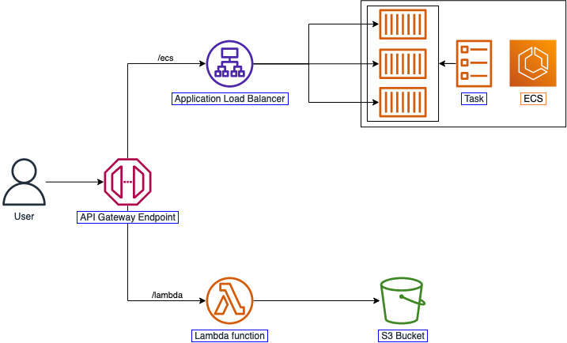

# CDK Basic - 2

#### Overview

It is recommended that before doing the CDK Basic 2 Workshop, you should go through the [CDK Basic Workshop](https://000038.awsstudygroup.com/) to learn about CDK. You should have a little bit of knowledge about API Gateway, Elastic Load Balancer, Elastic Container Service, and Lambda. 

We will reuse the workspace that has been created in the CDK Basic part to perform this workshop. `CDK 2.27.0` would be used. After finishing this lab, you will know how to

- Use CDK to create a basic application architecture using API Gateway, Elastic Load Balancer, Elastic Container Service, and Lambda.
- Create nested stack using CDKHere is the architecture that we would build:

Here is the architecture that we would build:

#### Content

1. [Introduction](1-introduce/)
2. [Preparation](2-prerequiste/)
3. [API Gateway and ECS](3-apigatewayandecs/)
4. [Lambda and S3](4-lambdaands3/)
5. [Nested stack](5-nestedstack/)
6. [Clean up](6-cleanup/)