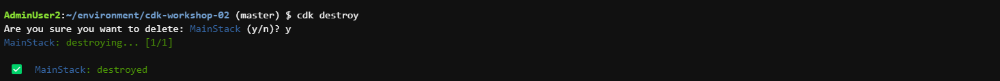

# CDK cơ bản - 2

#### Tổng quan
Trước khi làm workshop về CDK này, bạn nên đi qua workshop về [CDK cơ bản](https://000038.awsstudygroup.com/) để hiểu các khái niệm cơ bản của CDK. Bạn cũng nên có một vài kiến thức cơ bản về API Gateway, Elastic Load Balancer, Elastic Container Service và Lambda.

Chúng ta sẽ tái sử dụng workspace đã tạo trong phần CDK cơ bản để thực hành bài lab này. `CDK 2.27.0` sẽ được sử dụng. Sau khi hoàn thành bài lab này, bạn sẽ biết cách

- Sử dụng CDK để khởi tạo một kiến trúc ứng dụng cơ bản sử dụng API Gateway, Elastic Load Balancer, Elastic Container Service, và Lambda.
- Tạo nested stack sử dụng CDK

Kiến trúc tổng thể của hệ thống mà chúng ta sẽ xây dựng như sau:

#### Nội dung
1. [Giới thiệu](1-introduce/)
2. [Chuẩn bị](2-prerequiste/)
3. [API Gateway và ECS](3-apigatewayandecs/)
4. [Lambda và S3](4-lambdaands3/)
5. [Nested stack](5-nestedstack/)
6. [Dọn dẹp tài nguyên](6-cleanup/)